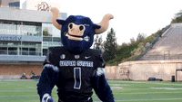
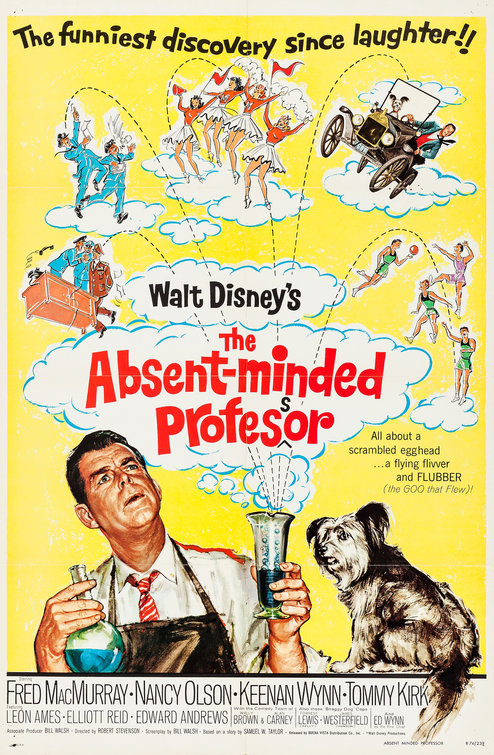

# The End of My Last Semester at UNL

I've been officially off-contract at UNL for almost four weeks. In that time, I've packed up most of my house, read about 30 novels[^1], bought a house, created a strategy to sell a house, and 3D printed a small medieval-style arsenal for my kid's summer camps.

[^1]: Not quality literature -- murder mysteries involving puppies and other similar caliber stuff. This is the reading equivalent of downing a pint of ice cream after a bad breakup - the goal is actually to eat(read) an excessive amount of junk. 

I have intentionally *not* done any UNL-related work. I have also not done any USU course prep.

{#fig-do-not-disturb fig-alt="A panda, lying in a hammock, with a sign that says do not disturb hanging from its foot" width="30%"}

# Trouble Brewing...

Yesterday, I received a fun [letter](ltr to VanderPlas from Chambers re Publication Affiliation.pdf) from the University of Nebraska system legal office.

::: {.callout collapse=true}
## RE: Clarification Required Regarding Publication Affiliation

> June 10, 2026
>
> Dr. Susan VanderPlas
>
> susan.vanderplas\@unl.edu
>
> RE: Clarification Required Regarding Publication Affiliation
>
> Dear Dr. VanderPlas,
>
> The University is aware of a publication on arXiv titled “The Noisy Work of Uncertainty Visualisation,” in which you are listed as an author. Your affiliation in the publication is identified as the Department of Mathematics & Statistics at Utah State University. Given that the article was published on March 27, 2026, this attribution raises several concerns that require clarification.
>
> As of this date, you remain employed by the University of Nebraska under an appointment extending through May 2027. It is our understanding that the work underlying this publication was conducted while you were a member of the University of Nebraska faculty. Accordingly, the publication should reflect your University of Nebraska affiliation.
>
> If you have been performing work for Utah State University, please note that such activity must be disclosed and pre-approved in accordance with the University of Nebraska Board of Regents Bylaws 3.2.8 regarding Conflict of Interest and Conflict of Commitment and 3.4.5 regarding Outside Employment. If you have been working for Utah State University, please update your COI/COC form accordingly.
>
> If you have not performed work for Utah State University, we ask that you promptly request a correction to the affiliation listed on the arXiv publication. If this matter is not resolved by June 15, 2026, the University will contact arXiv directly to reveal the inaccuracy and request a correction. Additionally, if you have accepted full-time employment with another institution, please submit your formal resignation and specify your intended final date of employment with the University of Nebraska.
>
> We appreciate your prompt attention to this matter and ask that you respond at your earliest convenience.
>
> Sincerely, Bren H. Chambers 
> Vice President & General Counsel

:::

# Initial Reaction

In roughly chronological order, I've attempted to distill my thought process reading the letter. 

::: aside

{#fig-fail fig-alt="A gif of a baby falling over, face first, onto the couch."}

:::

1.  Wait, they're checking up on what I put on ArXiV? Like, the place where you can have an abstract of ["Probably not."](https://arxiv.org/pdf/1110.2832), and papers [exploring what would happen if the earth were replaced by uncompressed blueberries](https://arxiv.org/pdf/1807.10553)? 

2.  "Given that the article was published on ..." ... Wait, putting something on ArXiV counts as publishing?

3.  Ok, someone jumped the gun on updating my affiliation, big deal. It's fixable. Just tell me it's an issue - you don't need to creep on me or threaten me.

4.  "As of this date, you remain employed by the University of Nebraska under an appointment extending through May 2027." Uh, no, I can resign at any time, and in fact I did resign effective August 15, I just didn't copy Legal on it because who does that?

5.  Wait, do they think I've been working at USU this semester? Like I have the time to do two academic jobs simultaneously!?!? Maybe some superwoman could pull that off, but I certainly can't. (@fig-fail) 

6. Why is the University of Nebraska System office following up on this instead of e.g. the University of Nebraska -- Lincoln campus office? There are lawyers at both, and one is more directly in my chain of command. 

    This kind of system-level management only adds fuel to the fire of faculty speculation about the system takeover of UNL, the fact that President Gold clearly does micromanage the campuses (and apparently even down to monitoring individual faculty), and the suspicion that the program cuts were targeted to get rid of outspoken faculty/departments^[This despite the fact that I can't think of anyone in the stat department that was particularly outspoken or politically active -- I asked hard questions in the Faculty Senate occasionally, but I don't think I was uncivil or even outside the bounds of "Nebraska Nice" until the department was already proposed for elimination.]. I was a bit paranoid before, but now it feels like they're actively monitoring search engine results for my name or something, which is just weird^[It also makes me want to do some fun astroturfing just to see what I can provoke... but I have more urgent things to do at the moment, like pack my house into boxes to move.]. 

7. If they are tracking all of my publications and even ArXiV submissions, then why do I have to type all this stuff in every year for my annual evaluation, in 3 different places? Couldn't they just fill it in for me, save time, and improve data quality? Wouldn't that be a win-win-win?

# The actual situation

Ok, so the letter from legal is obviously not quite clear on what they think is happening. Here's what actually happened, with gifs because this post needs something entertaining in it...

1. I went to Australia to attend a couple of conferences in December 2023. (@fig-aus)

::: aside

{fig-alt="A clip of Bluey dancing" #fig-aus}
:::

2. While I was there, I met a student who was working on uncertainty visualization. We had an ADHD and lack-of-sleep fueled hyperfocus session one night and somehow I ended up on her committee a few months later, with a ~5-10% advising responsibility.  (@fig-hyperfocus)

::: aside

{fig-alt="A gif of a guy moving his hands away from his forehead as a circle of light/stars/galaxy pattern expands around him." #fig-hyperfocus}
:::

3.  For the next ~18 months, I go to a meeting once a week when I can manage it and read stuff and comment on it. Since the meetings end up being at 6 or 8pm my time, depending on daylight savings in each country, I miss quite a few of the meetings because of traffic and kids and PTO meetings, or just because I got home from a long day and totally spaced. 

4. At some point during a meeting (probably late march), I mentioned that I had accepted or was planning to accept a position at USU. I honestly don't remember if I mentioned when I'd start or not. (@fig-utah) 

::: aside

{#fig-utah fig-alt="The Utah State mascot"}
:::

5. The student updated my affiliation on the paper draft we're working on to USU. I don't notice, because I'm generally pulling the paper and reading the file in markdown, and I skip everything at the top because it's not that interesting. I don't ever look at the compiled PDF of the paper closely enough to notice my affiliation has changed, but I complain about color choices in the graphics and nit-pick what's on the axes and find all sorts of spelling shenanigans, only half of which are just US vs. UK spelling differences like visualisation and colour. At least, I assume that's what I did. (@fig-spell) 

::: aside

{#fig-spell fig-alt="A gif saying that's not how that's spelled"}
:::

6. The paper draft was uploaded to ArXiV. My Aussie collaborators are so much better about this than I am. I usually just put it on GitHub and call it a day. 

7. The paper draft is cited by a couple of people but is generally not making headlines anywhere.

8. (Yesterday) University of Nebraska (System) legal sends me this email that is probably just a request for information, but sounds way more serious than a gentle "Hey, I noticed this paper says you're at USU, were you aware of it?" email. (@fig-vinnie)

::: aside

{fig-alt="A gif from My Cousin Vinnie of a lawyer leaning back in a chair." #fig-vinnie}

:::

9. I spend 2 hours composing an email back to them, outlining a lot of different ways they're factually incorrect (I've found a few more since). (@fig-typing) 

::: aside

{fig-alt="A gif of a cartoon woman typing furiously" #fig-typing}

:::

10. I spend 10 minutes talking with my Aussie collaborators about how ridiculous this whole misunderstanding is. They agree to remove my affiliation from the paper entirely, for the time being. Hopefully this settles the actual issue.

11. Having received no response from legal after 24 hours, and considering they gave me a 5 day response window that was in reality 2.5 business days, but actually 1.5 business days considering the date line and such, during a time when I'm off contract and not supposed to be dealing with UNL, I decide to write this post. 

# Possible scenarios according to University of Nebraska's General Counsel

1. I listed myself as working for USU (out of spite? forgetfulness? insanity?) instead of UNL and need to be reminded who I am currently being paid by. 

2. I have been "performing work for USU" and neglected to get that work pre-approved. 

3. I have accepted a job somewhere else, but I've forgotten to resign from UNL (out of spite? forgetfulness? insanity?) and need to be reminded that I am required to let them know not to pay me.

::: aside

{fig-alt="The poster for the Disney movie 'The Absent-minded Professor'" #fig-absentminded}
:::

Option 3 assumes that I have not already submitted my letter of resignation (I have). Evidently, I should have copied the UN System VP & General Counsel on the email - I thought it was sufficient to inform my supervisor and the HR contact for our department. 

Option 3 also seems to assume that I have some obligation to inform UNL as soon as I accept another full time position. In reality, Nebraska is an at-will state, and I couldn't find any Board of Regents policies listing an expected notice period. HR requested at least 5 business days notice as a courtesy; I provided something like 60 days notice. As far as I can tell, there is no written policy at the system level^[I didn't look too hard at the campus level because it didn't seem relevant.] about how much notice should be given. Informally, I told my colleagues in the statistics department that I'd be leaving back when I accepted the offer - there wasn't any reason to hide it. 

# Bylaws, Policies, and the Importance of Proofreading

> please note that such activity must be disclosed and pre-approved in accordance with the University of Nebraska Board of Regents Bylaws 3.2.8 regarding Conflict of Interest and Conflict of Commitment and 3.4.5 regarding Outside Employment.

It turns out there's no section 3.2.8 in the Bylaws PDF. Maybe they meant 3.8.2? No, there's not a section 3.8.2 either. There is a [Section 3.8](https://docs.nebraska.edu/unop/docs/Board%20of%20Regents/Policies/board-governing-documents/bor.pdf) [PDF as of today](20260611-board-of-regents-bylaws.pdf), which refers to [Regents policy 3.8.2](https://docs.nebraska.edu/unop/docs/Board%20of%20Regents/Policies/board-governing-documents/board-of-regents-policies.pdf) [PDF as of today](20260611-board-of-regents-policies.pdf). I've copied both of them from the PDF, changing only minor formatting things (and removing footnotes) in order to simplify the markdown to HTML conversion process used when I publish this post. 

::: {.callout collapse="false"}
# BOR Bylaws 3.8 Conflict of Interest.

No employee of the University shall engage in any activity that in any way conflicts with duties and responsibilities at the University of Nebraska. The Board of Regents has adopted Regents Policy 3.2.8 and authorized the implementation of related policies and directives to properly avoid, disclose and manage potential conflicts of interest.

History: Amended, 69 BRUN 15 (5 March 2010)\
Amended, 47 BRUN 147 (24 July 1982)
:::

> any activity that in any way conflicts with duties and responsibilities at the University of Nebraska System

By my read, this situation (advising a graduate student elsewhere) isn't a conflict because it doesn't interfere in any way with duties and responsibilities of my position at UNL. 
The rest of this post will delve into that in more depth, but I've clearly disclosed what I'm working on to the university to the greatest extent that I'd consider reasonable -- I'm not going to log everything I spend time on outside of UNL business (that's one reason why I'm not working in industry -- timesheets are too detail oriented for me unless they also include a code to use for time spent on time-tracking activities). 
While academia is not a 40-hour a week, 9-5 gig, it also isn't supposed to be a 24/7/365 job either -- they don't pay enough [for me to be on-call and available all the time.]{style="color:grey30"} 

I have also clearly communicated about my collaborative relationships to both of the chairs I have had in the past. Neither one mentioned anything about reporting that relationship as a COI - it's just part of the overall job, and thus isn't a conflict by definition. Also, the meetings happen outside of working hours and it's an insignificant amount of time - I've spent more time fighting with the stupid printers we have in the department, by far. 

::: {.callout collapse="true"}
# Regents Policy 3.2.8 Conflict of Interest and Conflict of Commitment

1.  Introduction

    University relations with industry, government agencies, individuals, and other enterprises outside the University constitute a complex network of interactions. These interactions have directed attention to potential conflicts of values and interests between these entities and academia. Conflict of Interest is addressed in Section 3.8 of the Bylaws of the Board of Regents as follows:
    
    > 3.8 Conflict of Interest. No employee of the University shall engage in any activity that in any way conflicts with duties and responsibilities at the University of Nebraska System. The Board of Regents has adopted Regents Policy 3.2.8 and authorized the implementation of related policies and directives to properly avoid, disclose and manage potential conflicts of interest.
    
    In addition to Section 3.8 of the Bylaws, Nebraska statutes relating to conflict of interest and nepotism apply to all public officials and employees of the University, including the provisions of §49-14,101.01 of the Revised Statutes of Nebraska.
    
    Furthermore, federal funding agencies require that the University establish safeguards to prevent employees or consultants from using their positions for purposes that are motivated by (or even give the appearance of) a drive for private financial gain either for themselves or family members.
    
    Responsibility for assurance of compliance with this policy rests with the CEO/President and CAO/Chancellor of each campus. The CAO/Chancellors shall submit an annual report to the CEO/President detailing the compliance policies, procedures and management activities at their campus, including other administrative units to which they provide compliance services.

2.  University-Wide Conflict of Interest Principles

    Conflict of interest policies will vary according to the unique roles and needs of each campus. However, each campus policy must ensure that broad University-wide principles are followed, including:

    1.  Prospects of financial gain must not unduly influence faculty and the University with regard to commercially imminent, product oriented research programs versus fulfilling the University’s objectives of educating students, advancing basic knowledge and serving Nebraskans through the development and application of knowledge that enables them to develop better lives, stronger communities and genuine economic opportunity.
    2.  The University must avoid situations where the possibilities for personal gain for the Covered Person may be judged to be so significant that it is unreasonable to expect the Covered Person to exercise the objectivity necessary for public trust in the University and the rigor of its research.
    3.  Research agreements should encourage the free exchange of ideas and the sharing of research results regardless of the sponsoring entity. Some constraints may be required to protect proprietary information or intellectual property.
    4.  To the extent practicable and consistent with applicable law, the University must be appropriately compensated for private, commercial use of the public property under its stewardship.

    Underlying these principles is the recognition that the University of Nebraska System is a public institution with a mission of serving the people of Nebraska through research, teaching and service.

3.  Annual Report

    Annually, each campus shall submit a written conflict of interest report to the CEO/President which includes at least the following information:

    1.  The number of conflicts disclosed, by appropriate academic unit.
    2.  A summary of the nature of the conflicts.
    3.  The number of conflicts being managed through written plans, by college or designated organizational unit.
    4.  The number of conflicts eliminated, by college or designated organizational unit.
    5.  Other material or information related to the management of conflicts of interest at the campus.

4.  Personnel Affected by Conflict of Interest and Conflict of Commitment Policy

    Covered Person shall mean:

    1.  University administrative officers and employees, specifically including any University employees with delegated signature, purchasing or contracting authority on behalf of the University;
    2.  University employees and faculty engaged in outside employment or other activities specified in this policy (tech transfer/use of University facilities or equipment. that may create a Conflict of Interest; and
    3.  Sponsored Research investigators, including University employees, faculty, staff and support personnel (managerial/professional and office/service positions), volunteers, trainees, students, contractors and other persons under the direct control of the University of Nebraska System, whether paid by the University of Nebraska System or not, who participate in Sponsored Research as defined in Section 6 of this policy 3.2.8.

    Conflict of Interest shall mean situations when a Covered Person’s direct or indirect personal financial interests may compromise, or have the appearance of compromising, the Covered Person’s professional judgment or behavior in carrying out his or her obligations to the University of Nebraska System. This includes indirect personal financial interests of a Covered Person that may be obtained through third parties such as a Covered Person’s Immediate Family, business relationships, fiduciary relationships, or investments.

    Immediate family shall mean an individual who is the spouse, child, parent, brother, sister, grandchild, or grandparent, by blood, marriage, or adoption of the Covered Person.

5.  Individuals and Organizations Responsible for Administration of Conflict of Interest and Conflict of Commitment Policy

    At the University of Nebraska System, all reporting of potential Conflicts of Interest should be undertaken with the goal of full disclosure. The CEO/President and CAO/Chancellors of each campus shall develop and implement a disclosure process and supporting procedures consistent with the principles set forth in this Policy, covering, at a minimum, sponsored programs administration, institutional review boards, any office of technology transfer, and any other responsible campus administrative officers. The CAO/Chancellors shall be responsible for overseeing their campus’ reporting process and must designate an administrative officer who will be in charge of developing more specific written procedures for enforcing the policy. Each CAO/Chancellor shall submit their campus’ processes and procedures to the CEO/President for review and approval.

    The procedures for disclosure at each institution must, at a minimum, include the following:
    
    1.  Annual disclosures by Covered Persons.
    2.  A description of the process for developing, implementing, and overseeing conflict management plans, including a detailed process for managing and/or eliminating potential Conflicts of Interest.
    3.  A description of procedures for ensuring coordination among all University organizations with a role in oversight of conflicts.
    4.  A description of the process by which a Covered Person may address concerns regarding a Conflict of Interest situation or the management thereof.
    5.  A description of how:

      - Disclosures will be reviewed and retained, and the level of activity of each college or institute within each major administrative unit will be reported to the CEO/President pursuant to subsection 3 above of this policy;
      - Responsible campus officials are to review and manage potential Conflicts of Interest;
      - The campus will provide related training and advice about Conflict of Interest issues;
      - The campuses will review and validate their program on a regular basis;
      - The campus will make its implementation procedures for this policy available publicly; and
      - The institution will enforce this policy and provide sanctions when necessary.

6.  Conflicts of Interest Involving Sponsored and Non-Sponsored Research
    
    Research is basic to the University's teaching and service missions. Good teaching and learning depend upon research. Likewise, through its research, teaching, and service/outreach activities, the University's resources can best be brought to bear on public issues requiring objective, systematic study. Research forms an inherent part of departmental and collegiate missions, and brings recognition to the University and its faculty. All forms of research, which are within departmental and collegiate missions, and which maintain the high quality characteristic of the University, are appropriate to the University's open environment. Similarly, University teaching and service/outreach activities have potential for commercial use and development.
    
    Sponsored Research means research, training, and instructional projects performed by Covered Persons using any University space, materials, equipment or property that involves funds, materials or other compensation from sources outside the University through a grant or contract that obligates the University to a specified statement of work, sets forth binding financial terms in the form of a budget or up-front payment, or contains terms related to ownership of and rights to use intellectual property developed thereunder. Sponsored Research is a vital endeavor of the University; it allows faculty the means to pursue excellence in their research and scholarly activity, it expands opportunities for graduate and undergraduate student participation in research, it enhances the quality of University research facilities through public and private support, and it helps facilitate the commercialization of research and technology to benefit the University and Nebraska. The University encourages its faculty and staff to engage in both sponsored and non-sponsored research recognizing that compliance with this policy can help assure that appropriate standards of accountability are met and extramural considerations do not hinder the dissemination or commercialization of research.
    
    Each campus shall establish its own Sponsored Research application approval process, including applicable internal or external peer review systems and implementing best practices for approving federally, publicly and privately sponsored research projects. The CAO/Chancellor shall be responsible for overseeing the research approval process and must designate an administrative officer who will be in charge of developing more specific written procedures for implementing the policy. The procedures for Sponsored Research approval at each campus must at a minimum include procedures for disclosing, identifying, reviewing, managing and reporting conflicts and potential conflicts that arise with regard to Sponsored Research on their campus pursuant to Section 5 of this policy. Non-sponsored research, including all internally funded research, shall require similar oversight and compliance.

7.  Openness of Research and Publication of Results

    
    The traditions of free exchange of ideas and prompt dissemination of knowledge are fundamental to the University's mission and should govern all research, teaching, and service/outreach activities conducted by University faculty, staff and students. The University is committed to an open teaching and research environment, which ensures free faculty and student exchange of ideas, thereby contributing to the advancement of knowledge in all disciplines. As far as possible, the acceptance of support external to the University should not create situations that curtail open discussion of the research among colleagues and students.
    
    Industry and select governmental agencies typically treats the products of its research in a very confidential manner. On occasion, industry and select governmental agencies expects project participants to maintain the same degree of confidentiality with sponsored research. It is important to note that openness, freedom of discussion, and freedom to publish go to the very core of the University. Nonetheless, there are certain legitimate needs for confidentiality on the part of industry and relevant governmental agencies that must be met by Sponsored Research investigators. Data received from an industry or agencies sponsor and marked "confidential" or “classified” may be kept in a confidential of classified status for a stated or indefinite period of time. Also, it is prudent to recognize the need to maintain the confidential status of the results of the project for a period of time sufficient to determine patentability and filing of patent applications or as agreed upon in an agreement between the sponsor and the University. When appropriate, the University may enter into confidential agreements to protect proprietary information, where this is deemed necessary, either through direct agreement with an industrial sponsor or through an agreement between the sponsor and a University employee.
    
    The official responsible for administration of research or other official designated by the CAO/Chancellor or CEO/President must ensure that all individuals who participate in industry- or agency-sponsored research projects are fully informed in writing of the ownership and disposition of inventions and requirements of confidentiality regarding research results and other confidential or classified information provided by the sponsors of such projects.
    
    Research conducted by faculty under industry or other commercial sponsorship must, as far as possible, maintain the University's open teaching, research, and service environment.
    
    The official responsible for administration of research or CAO/Chancellor’s or CEO/President’s designee must review and approve any new, proposed, or ongoing faculty-industry interactions as these interactions might compromise the University's open teaching and research environment. The appropriate department chair(s) or director(s), dean(s), and in rare circumstances, the individual designated to perform the complete administrative review as described in Section 1--shall aid in this process and shall seek to resolve all potential problems prior to the approval of such interaction.
    
    The campus official responsible for administration of research, compliance, or the CAO/Chancellor’s or CEO/President’s designee shall from time to time provide current information to the department chairs, deans, directors and faculty pertinent information for timely reporting of concerns regarding violation of the Conflict of Interest and Conflict of Commitment policy.
    
    Faculty must have the right to disseminate their research results, indeed are obligated to do so. The University discourages individual faculty from agreeing to forego this basic right unless it is in the national interest. Likewise, the University will not unilaterally forego this right on behalf of its faculty, staff and students. However, the University and faculty may accept reasonable delays in submission of new findings for publication or other release of information to enable sponsors or the University to obtain proprietary, national security, or patent protection, for example. In special circumstances to be determined by the University, a researcher may waive his or her right to disseminate the results of his or her research and elect to enter an agreement to maintain the confidentiality of proprietary research for specified periods of time.
    
    The campus official responsible for administration of research, compliance, or the CAO/Chancellor or CEO/President’s designee shall work with faculty engaged in industry- or agency-sponsored projects to provide written notification to support personnel and students involved in these projects, describing all contract and grant terms affecting them, including the possibility of delays in publication caused by the need of the sponsor to review manuscripts or any other obligations of confidentiality. Graduate students must not be assigned to thesis research topics that might be affected by confidential agreements. The appropriate campus official or CAO/Chancellor’s designee may authorize exceptions where appropriate.

8.  Outside Employment and Conflicts of Commitment
    
    The University not only permits but expressly encourages faculty to pursue outside professional activities including interactions with industry, with or without compensation, which will enrich a faculty member's academic contributions to the University. Consulting can expose faculty to research problems and perspectives which may enrich faculty teaching, research, extension, and service backgrounds. However, faculty and administration must be sensitive that such interactions could cause Conflicts of Interest and must ensure that Covered Persons do not make unnecessary or inappropriate commitments of their time or expertise which can adversely affect the University and its mission. A conflict of commitment must be disclosed and managed when it constitutes a Conflict of Interest for a Covered Person.
    
    The assumption that Covered Persons will devote their time and effort to the University in proportion to their appointments--that full-time appointment connotes full-time commitment of time, effort, and expertise to the University--is inherent in University employment. Outside consulting activities, often acceptable in themselves, can interfere with a University employee’s paramount obligations to the University by placing significant, competing demands upon the time and energy of a Covered Person with the potential for the neglect of instructional, research and other employment obligations. In some circumstances, a Covered Person’s proposed outside activities may directly conflict with the objective of assignments within the University.
    
    The University, through an outside employment policy enacted by the Board of Regents, seeks to minimize the potential for conflict of commitment by several mechanisms. The time that may be devoted to outside activity is normally limited to two working days per month; greater time commitments require specific approval of the Board of Regents. (For practical reasons, faculty are given considerable freedom in the scheduling of any outside activities.) In addition, the University must examine the application of an employee's expertise to proposed educational, industrial, or other consulting activities to assure that any Conflict of Interest and/or conflict of commitment is properly disclosed and managed. Hence, the University requires prior disclosure of proposed consulting, extramural teaching, or other activities to the department chair and the prior approval of the college dean and campus administration. Such disclosure may be made by completing the appropriate campus form for disclosure of outside employment and may require the provision of additional documentation to the chair, dean, or other administrator.
    
    In certain other circumstances, the specific approval of the Board of Regents may be required. The relevant policy of the Board of Regents is set forth in Section 3.4.5 of the Bylaws of the Board of Regents.
    
    Outside Activity and Employment. As University-industry relationships increase with a growing desire for consultantships and other professional activities outside the University, University employees must continue to observe the University policy on outside employment embodied in Section 3.4.5 of the Bylaws of the Board of Regents. In addition, University employees must observe the Board of Regents policy on Conflict of Interest stated in Section 3.8 of the Bylaws of the Board of Regents. Accordingly, each campus shall develop appropriate forms for employees to disclose
    
    1.  potential Conflicts of Interest, and
    2.  outside employment in order for review, documentation, approval and management of Conflicts of Interest and outside employment.
    
    Department chairpersons, department heads, deans, and directors have primary responsibility to review the specific nature of each proposed outside professional activity within their respective areas of administrative responsibility and to deny approval to any such activity that would interfere with the normal University duties of the employee involved and to require proper disclosure and management of any Conflict of Interest.
    
    It is impossible to anticipate all questions which may arise in connection with the application of Section 3.4.5 of the Bylaws to the varied outside professional activities of employees. However, several general guidelines are set out below to assist in the administration of this policy:
    
    1.  Section 3.4.5 of the Bylaws does not apply to Office and Service staff.
    2.  Section 3.4.5(a) of the Bylaws requires CEO/President approval of outside professional activities where the employees will accept retainer fees or other remuneration on a permanent or yearly basis as a professional consultant. The key consideration in determining whether there will be acceptance of a retainer fee or remuneration on a permanent yearly basis is the nature of the professional business relationship between the employee and his or her client or patient. If this business relationship is one where the employee is obligated at the beginning of the professional relationship with a client or patient to provide professional services over a period of one year or longer, then approval by the CEO/President is required.
    3.  In addition to obtaining prior approval of the department chair and campus administrator, Section 3.4.5(b) of the Bylaws requires CEO/President approval of outside professional activity requiring more than an average of two days per month during the period of the employee’s full-time employment. The Board of Regents has interpreted this language to mean two days per month during the assigned work week. For this reason, CEO/President approval will only be required when an employee's outside professional activities will prevent the performance of his or her assigned duties at the University more than an average of two days per month during the period of full-time employment.
    4.  Section 3.4.5 of the Bylaws requires CEO/President approval of outside professional activity involving the charging of fees for work performed in University buildings with University equipment and materials. The CEO/President and CAO/Chancellors are authorized to develop specific policies with regard to the charging of fees for work performed in University buildings with University equipment and materials.
    5.  Section 3.4.5 of the Bylaws does not require individual approval of each separate client or patient relationship for professionals such as accountants, engineers, architects, lawyers, psychologists, therapists, etc. It is sufficient that the nature of the outside professional activity be generally described so that appropriate evaluation may be conducted regarding potential interference with University duties, Conflict of Interest, and conflict of commitment. So long as none of the circumstances requiring CEO/President approval under subparagraphs (a), (b), (c), and (d) of Section 3.4.5 of the Bylaws exist, no further information need be provided by the employees, and the professional activity may be approved by the CAO/Chancellor upon the recommendation of the appropriate dean or director.
    6.  Activities for a professional organization with which an employee is associated do not constitute the type of professional activity coming within the scope of Section 3.4.5 of the Chapter 3. Terms and Conditions of Employment RP-95 Bylaws unless a professional service is provided to the organization for which the employees is paid a professional fee which is commensurate with the actual value of the professional service provided.
    
    The foregoing should not be construed to relieve any employee of complying with applicable policies or regulations of the department, college, division, campus, or University with regard to time one is allowed away from regular University duties.
    
    University employees proposing outside employment or a consulting relationship of any nature pursuant to Section 3.4.5 of the Bylaws are required to complete the appropriate campus form for disclosure of outside employment.
    
    Furthermore, consistent with the foregoing policy statement regarding conflicts of commitment and the effect such conflicts can have on a faculty member’s research programs and the duties faculty members owe the University, University employees proposing outside employment or a consulting relationship with a third party shall disclose to the University any: i) confidentiality or non-disclosure agreements, ii) non- compete agreements or any agreement containing a non-compete clause, iii) assignments of intellectual property rights to the contracting party, and iv) involvement with commercial or educational enterprises where the name of the University may be used for commercial gain to the CAO/Chancellor or the CAO/Chancellor’s designee. Although agreements of this type can be problematic, the University shall endeavor to promptly review such agreements and resolve any potential conflict of commitment to allow the University employee to perform the proposed outside employment or consulting while maintaining the integrity of their research projects and commitments to the University.

9.  Conflicts of Interest Involving Technology Transfer
    
    University projects have resulted in the creation of new Nebraska businesses which have transferred research results into products and services and which have contributed to the State's economy. Certain research discoveries lend themselves to commercialization by starting new ventures through the University or through faculty rather than the traditional licensing to existing companies. Moreover, this means of commercializing discoveries may be the best, or in some instances the only, means to transfer such new technology. The University recognizes this as an acceptable method of commercializing discoveries when it is in the best interests of the University, the State, and the inventor and is the most effective means to transfer such technology.
    
    In establishing new companies to commercialize University technology, the University may accept equity positions or combinations of equity and future royalties in return for licensing the technology. This is an acceptable University activity and is an integral part of the technology transfer program. However, in such situations, reasonable limits on the University's involvement with respect to administrative time and the amount of equity taken must be observed. University technology transfer activities shall be governed by Section 3.10 of the Bylaws and Section 4.4.2 of the Policies. Such oversight will enable the University to be aware of and take steps to prevent or manage potential Conflicts of Interest which may arise, involving, among other things, favoritism in future dealings with the same company, discrimination against its competitors, or the use of public funds for private gain. Accordingly, University direction of the company must be limited in time, and the amount of equity taken must be less than controlling. The Board of Regents has separately authorized and delegated authority to the University Technology Development Corporation (UTDC), and nothing in this policy is intended to limit the authority of UTDC as it relates to properly managing or preventing conflicts of interest or otherwise.
    
    Conflict situations also apply to any profit- or nonprofit-affiliated private entities established by the University or one of its employees. Therefore, in the University's relations with all such entities, the Conflict of Interest policy must be followed.
    
    Where University technology is transferred in return for an equity position, or royalties, or projects are to be performed in exchange for an equity position, the affected University employees must fully disclose such proposals, and a suitable arrangement that reflects the Regents Policy must be concluded prior to approval of the proposal.
    
    For-profit entities have been formed specifically to fund research and development, such as research and development limited partnerships. Such entities solicit investors from members of the public. There is the possibility that prospective investors may be induced to invest by what appears to be University involvement in the funding entity or by unrealistic expectations of the outcome of the projects. In either event, the name of the University could be unfairly traded upon. Therefore, care must be taken that the investor solicitation is consistent with the potential outcome of the research and the policy on the use of the University's name.
    
    Where appropriate, the University may accept equity in a company as complete or partial payment for transferring University technology to the company for commercialization. Only the Board of Regents may approve acceptance of equity in a company upon the recommendation of the CEO/President.
    
    The University may designate individual(s) to hold membership on the board of directors of a company in which the University holds equity.
    
    University faculty, administrators, or other members of the University community holding any such board of directors membership shall oppose or absent themselves, as appropriate, from any funding decisions or other decisions relating to the University which:
    
    1.  violates or is contrary to any law or University policy or procedure in regard to grants or contracts;
    2.  would constitute a Conflict of Interest with such person's University office of employment; or
    3.  involves improper use of University (public) funds.
    
    When external entities raise funds for University projects through any form of investment offerings, University personnel must scrupulously avoid the endorsement of any such offering or any statement of potential research results. The University's prior written consent must be obtained to use its name in connection with advertising or promotion of any investment offering.
    
    The past history of funding of University research or other projects by any company or firm shall not have any bearing on purchasing decisions made by the University of Nebraska System.

10. Institutional Conflicts of Interest
    
    An Institutional Conflict of Interest may occur when the University or a Covered Person in a senior administrative position has a financial interest in a commercial entity that itself has an interest in a University project, including potential conflicts with equity/ownership interests or royalty arrangements. Each campus shall develop and establish processes and procedures for review of institutional conflicts involving technology transfer or other commercial activities. This process must at a minimum include:
    
    1.  Procedures for identifying and overseeing institutional Conflicts of Interest;
    2.  Principles and strategies for managing institutional Conflicts of Interest; and
    3.  Principles and strategies for institutional management of equity.
    
    Each CAO/Chancellor shall submit their campus’ processes and procedures for review of institutional Conflicts of Interest to the CEO/President for review and approval.

11. Appeal of Administrative Decisions

    
    Each campus shall assure that an appeal mechanism is in place to allow Covered Persons to appeal an adverse decision relating to this policy.
    
    Reference: BRUN, Minutes, 58, pp. 11-12, (February 13, 1993). \
    BRUN, Minutes, 60, p. 20, (March 24, 1995). \
    BRUN, Minutes, 69, pp. 16-30, (March 5, 2010). \
    BRUN, Minutes, 77, p. 80 (February 6, 2026)
:::

This is a really long chunk of policy. To summarize, there are 11 sections that roughly go like this:

1. Motivation
2. University-wide principles
3. Responsibility of each campus (not my problem)
4. Who the policy applies to
5. How the policy is managed
6. COIs and Research
7. Confidential and Classified Agreements with other organizations (N/A here)
8. Outside Employment (what they're worried about)
9. Technology Transfer (N/A here)
10. COI for Admin (N/A)
11. Appeal Process (hopefully N/A?)

So, we mostly need to look at sections 1, 2, 4, 5, 6, and 8. 

## Motivations

The goal of the COI policy is to 

> - properly avoid, disclose and manage potential conflicts of interest.

> - prevent employees or consultants from using their positions for purposes that are motivated by (or even give the appearance of) a drive for private financial gain either for themselves or family members.

Ok, that's fair. Of course, in this case, there is no way to use my position at UNL for private financial gain by advising a student without any compensation. If there's financial gain to be had here, I'm obviously not seeing it.

## University-Wide principles

The university is supposed to establish processes to ensure the following:

>  1.  Prospects of financial gain must not unduly influence faculty and the University with regard to commercially imminent, product oriented research programs versus fulfilling the University’s objectives of educating students, advancing basic knowledge and serving Nebraskans through the development and application of knowledge that enables them to develop better lives, stronger communities and genuine economic opportunity.
    2.  The University must avoid situations where the possibilities for personal gain for the Covered Person may be judged to be so significant that it is unreasonable to expect the Covered Person to exercise the objectivity necessary for public trust in the University and the rigor of its research.
    3.  Research agreements should encourage the free exchange of ideas and the sharing of research results regardless of the sponsoring entity. Some constraints may be required to protect proprietary information or intellectual property.
    4.  To the extent practicable and consistent with applicable law, the University must be appropriately compensated for private, commercial use of the public property under its stewardship.
    
Examining this situation for potential violations of these basic principles, it's clear that (1) doesn't apply because there are no commercial products here. (2) doesn't apply because there is no possibility of personal gain. (3) is not violated either -- this research is open, which is how the legal department found out about the paper in the first place! You don't put things on ArXiV because it's lucrative, you put them there because you believe research should be open and transparent, or because you want to help people legally avoid paying journals for access to your work by publishing the preprint. (4) doesn't apply because there's no commercial use of any intellectual property here. It also doesn't apply because all of the software associated with this project is open source and can be used commercially or noncommercially so long as it's cited properly. 

I'm a big believer in complying with the intent behind a law. Sometimes, that puts me at odds with the actual text of the law, but in this case, I'm comfortable with the intent and that I haven't violated it. 

---

We can skip section 3, because it's talking about things that aren't my problem. 

## Who does the policy apply to?

Section 4 defines covered persons:

> Covered Person shall mean:
> 
> 1.  University administrative officers and employees, specifically including any University employees with delegated signature, purchasing or contracting authority on behalf of the University;
> 2. University employees and faculty engaged in outside employment or other activities specified in this policy (tech transfer/use of University facilities or equipment) that may create a Conflict of Interest; and
> 3. Sponsored Research investigators, including University employees, faculty, staff and support personnel (managerial/professional and office/service positions), volunteers, trainees, students, contractors and other persons under the direct control of the University of Nebraska System, whether paid by the University of Nebraska System or not, who participate in Sponsored Research as defined in Section 6 of this policy 3.2.8.^[The term Covered Person includes the definition of an "Investigator" under NIH guidelines, specifically "the Principal Investigator and any other person who is responsible for the design, conduct, or reporting of research funded by the NIH, or proposed for such funding. The definition includes contractors or collaborators, as well as the Investigator’s spouse and dependent children." See Responsibility of Applicants for Promoting Objectivity in Research for which PHS Funding is Sought (42 CFR Part 50, Subpart F, grants and 45 CFR Part 94, contracts).]

4.1 does not apply -- I have no authority whatsoever. You can ask my kids or my graduate students. 

4.2 does not appear to apply to this situation^[I have other outside activities that do qualify as outside employment. The parenthetical seems to restrict other activities to technology transfer and use of facilities/equipment, neither of which applies here.]. 

::: aside

> "... and other persons under the direct control of the University of Nebraska System, whether paid by the University of Nebraska System or not"

Interesting. What does one have to do to be under the direct control of the system? If you asked anyone in admin, they'll say I've been out of control for the entire academic year.

:::

4.3 does seem to apply - I'm clearly a researcher. 
However, I would dispute that I'm under the *direct control* of the UN system, even when I do receive a paycheck from them. 
It's a bit murky whether or not I am currently considered an employee -- I have a 9 month appointment, my contract is not currently in effect, but I'm currently receiving summer grant pay and benefits (until my resignation date, hopefully -- I'm still not sure whether UNL is going to live up to that part of the bargain...).
It would be more clear cut if I were returning for Fall 2026, but I'm not. 

It's also interesting to note that apparently my children are also covered people under this policy -- meaning that I guess I'm supposed to disclose any lemonade stands as "outside activity" by covered persons. Does this mean I'm also supposed to get clearance from Legal before I let them open the lemonade stand?^[I'm sure that if I did ask Legal for permission for my children to run a lemonade stand, they would tell me I'm being an idiot. Maybe they'd phrase it more politely... but maybe not. ] Essentially, the university is claiming that employing me allows them to exert an amount of control over my entire family that is ... extreme.^[I've been told in the past that my interpretation of legalese is ridiculous, but honestly, I think the problem is that legalese assumes too much and then it's my fault if I don't comply with their assumptions, seek out loopholes, or maliciously comply with poorly expressed ideas.] 

> Conflict of Interest shall mean situations when a Covered Person’s direct or indirect personal financial
interests may compromise, or have the appearance of compromising, the Covered Person’s professional
judgment or behavior in carrying out his or her obligations to the University of Nebraska System. This
includes indirect personal financial interests of a Covered Person that may be obtained through third
parties such as a Covered Person’s Immediate Family, business relationships, fiduciary relationships, or
investments.
Immediate family shall mean an individual who is the spouse, child, parent, brother, sister, grandchild, or
grandparent, by blood, marriage, or adoption of the Covered Person.

Ok, I don't believe for a minute that advising a student at another university could have the appearance of compromising my professional judgement or my behavior, and I also don't think it would in any way affect my ability to carry out my obligations to the UN system. 

I spend more time per week doomscrolling than I do talking to this student, but I refuse to believe that doomscrolling constitutes a conflict of interest -- for that to be true, it would essentially imply that the UN system believes they have a claim to my time 24/7/365. 

More importantly, though, the definition concerns my personal financial interests. This has nothing to do with my financial interests, because I'm not getting paid by anyone in Australia. I'm also not being paid by USU (at least, until August). 

{#fig-not-paid fig-alt="A gif of two guys saying 'Joke's on you, I'm not getting paid'" width="30%"}

## How is the Policy Managed

> At the University of Nebraska System, all reporting of potential Conflicts of Interest should be undertaken with the goal of full disclosure.

Hmm. Interesting. Given that I was supposed to have access to all of the information used to determine that the statistics department should be closed (so that we could effectively counter that in our hearing before the APC), it appears that "full disclosure" doesn't mean the same thing to me as it does to the administration. Nevertheless, I've always compliied with this goal. You can tell, because I have actually updated my COI/COC disclosures a couple of times this semester. 

It's interesting that the COI/COC process requires that you update your disclosure form within 30 days of a potential COI/COC, but you are supposed to have affirmative approval of a COI/COC situation before you begin that work. If the process were actually compliant with the policy as written, it would seem to require that the COI/COC be disclosed and approved before it is undertaken. 

So, for instance, if I were going to serve as an expert witness, I would need to get that activity cleared with the President/CEO directly. I wouldn't, for instance, go through my chair, ask what I need to set up to make this happen, and have everything set up at least 12 months before any actual work happened and at least 48 months before I got paid for any work. Just as a hypothetical. 

## COIs and Research

> Sponsored Research means research, training, and instructional projects performed by Covered Persons using any University space, materials, equipment or property that involves funds, materials or other compensation from sources outside the University through a grant or contract that obligates the University to a specified statement of work, sets forth binding financial terms in the form of a budget or up-front payment, or contains terms related to ownership of and rights to use intellectual property developed thereunder.

By this definition, this project is not sponsored research, because it doesn't obligate the university to a specific statement of work and has no binding financial terms (because I'm apparently willing to work for free if pretty `ggplot2` charts are involved). 

>  The University encourages its faculty and staff to engage in both sponsored and non-sponsored research recognizing that compliance with this policy can help assure that appropriate standards of accountability are met and extramural considerations do not hinder the dissemination or commercialization of research.

Ok, if this is the goal, then there are no extramural considerations and there is no hampering of the dissemination of research. By working under an open-source license, we are probably hindering the commercialization of research, but for some reason they're not concerned about that right now^[I give it a year or two before the University starts cracking down on free-as-in-beer software development and tries to recoup some funds by forcing researchers to license code.].

> Non-sponsored research, including all internally funded research, shall require similar oversight and compliance.

This is literally the only bit where it talks about non-sponsored research. It's unclear why if the goal is to avoid the appearance of undue financial interest, similar oversight and compliance would be required for research that isn't funded.

---

Section 7 of the policy doesn't apply here - everything in this project is open-source, we're completely transparent about the process and the data is available on GitHub; there is no attempt to keep anything confidential except participant identities as required by the ethics board/IRB equivalent. 

## Outside Employment

Section 3.8.2 section 8 further clarifies the difference between COI and conflict of commitment:

> faculty and administration must be sensitive that such interactions (outside professional activities) could cause Conflicts of Interest and must ensure that Covered Persons do not make unnecessary or inappropriate commitments of their time or expertise which can adversely affect the University and its mission. A conflict of commitment must be disclosed and managed when it constitutes a Conflict of Interest for a Covered Person.

Ok, so let's consider this angle - did my advising this student constitute 

- an unnecessary or inappropriate commitment of time and expertise 
- that adversely affects the university and its mission?

### Time
Leaving aside who determines what is necessary (or appropriate, for that matter), I think it's plain that an hour or less per week does not constitute a significant amount of time that would adversely affect the university and its mission. I have colleagues who spend at least that much time each week trying to figure out how to send an email attachment or download something off the web. I've probably spent similar amounts of time trying to figure out how to get the printer in the department to work with Linux, since every network update seems to bork my CUPS installation. 

"Appropriate" time/expertise commitment is apparently 2 business days per month of outside activity. This research commitment is somewhere on the order of 3-4 hours per month, outside of working hours. Granted, it's a collaboration with Monash University instead of USU, but I'm in CYA mode here.

### Adverse Effects on Mission

I think my performance at UNL has been decent. 
I've published more than the expected 1-2 papers per year^[Though, if I'd known that ArXiV papers count as publications according to the UNL system, I probably would have uploaded more drafts there.], I've graduated several PhD students in the 6 years I've been here as well as many more MS students, I've taught my classes and gotten reasonable evaluations^[Excepting, perhaps, the student who said "She talks like William Shatner" -- I still have no idea if that's a compliment or a complaint.], and I've done quite a lot of university and disciplinary service (some of which I've been told was an adverse time commitment...). I've developed some very well regarded undergraduate courses that will no longer be offered because of the program elimination, and I wrote an open textbook for statistical computing in R and python just because it was fun and made it easier to teach students. Quite a few of these things were done even when my supervisors and mentors suggested not spending the time on them, because I thought they were important. 

I've disclosed external consulting activities like serving as an expert witness, which is a direct extension of my research and is arguably a positive contribution to the university and its mission. In one case this spring, I ended up getting stuck away from campus during the semester for about 5 work days -- a situation which was clearly communicated to my supervisor and my students. Thanks to the magic of zoom, I could still fulfill my teaching and research responsibilities even as I waited to testify in the trial. It was a pain, but I would argue that I didn't actually miss even the allowed 2 days, because I was still meeting all responsibilities. 

So, all in all, I'd read this and determine that in no way does my advising a student elsewhere count as a conflict of interest or commitment. 

---

Sections 9, 10, and 11 clearly do not apply to this situation, so I'm going to move on to the Bylaws. 

::: {.callout collapse="true"}
# BOR Bylaw 3.4.5 Outside Employment.

Staff members employed on a part-time basis by the University, such as practicing lawyers or physicians, may engage in outside employment or activities unless it is expressly stipulated to the contrary in the conditions of employment.

Staff members employed by the University, other than those covered in the preceding paragraph, shall be encouraged to engage in professional activities outside the University as a means of contributing to the economic growth and development of the state as well as broadening their experience and keeping them abreast of the latest developments in their specialized fields; provided such activities do not interfere with their regular duties at the University, or represent a conflict of interest. Staff members may accept temporary or occasional employment for such professional services when such employment is recommended by the Dean of the college or director of the division involved and approved by the CAO/Chancellor or CEO/President, or their designees. Specific approval of the CEO/President is required before any members of the full-time professional staff:

a.  May be retained to provide professional services outside the University to an individual person, client, company, firm or governmental agency over a time period lasting more than two years.

b.  May accept professional employment requiring more than an average of two days per month during the period of his or her full-time University employment. The CEO/President shall promulgate such executive policies as shall be necessary for administration and enforcement of this Section 3.4.5 including regulations covering the conduct of outside professional activity performed in University buildings using University equipment or materials that assure there is adequate consideration to the University for such use. Nothing contained in this Section 3.4.5 shall affect the administration or enforcement of the Medical Service Plan or the Dental Service Plan at the University of Nebraska Medical Center, or any amendments or revisions thereof which have been approved by the Board.

History: Amended, 77 BRUN 32 (19 June 2025.\
Amended, 65 BRUN 142 (16 September 2005.\
Amended, 56 BRUN 90 (22 June 1991.
:::

Let's consider the policy on outside employment. 

> Staff members employed by the University, [...] shall be encouraged to engage in professional activities outside the University as a means of contributing to the economic growth and development of the state as well as broadening their experience and keeping them abreast of the latest developments in their specialized fields; provided such activities do not interfere with their regular duties at the University, or represent a conflict of interest.

We've already established that my regular duties have been dispatched with adequately (hopefully, above-adequately), and that they don't represent a COI by the definitions in the regents bylaws. Now, arguably, it doesn't contribute to the economic growth of the state, but it does keep me up to date with developments in visualization and statistical graphics. 

So, given that this outside activity does enrich my experience and doesn't represent a COI or conflict with my duties, I don't think I'm in violation of this policy, even though I firmly maintain that this doesn't meet the basic definition of employment - I'm not getting paid. 
I also don't have any official relationship or position at the student's university other than a couple of documents naming me as an external committee member.

Employees have to get approval of the CEO/President if (1) the position lasts more than two years for a single person/client/company/agency, or (2) the employment requires more than 2 days per month during the period of full time University employment - conditional statements suggest the university's primary interest is in ensuring that the University gets compensated for use of university buildings/equipment/materials. 

The first statement doesn't apply because I wasn't retained or given any sort of retainer fee or remuneration (again, this would suggest a contract or some sort of employment which isn't present). 
Granted, I suppose technically I've been working with this student for about 30 months at this point (27 by the time the dissertation was done and the "advising" role I took on was completed). 
The second statement definitely doesn't apply -- I spent maybe 4 hours (generously) a month in meetings, outside of university time and not using university resources beyond reading papers from the library -- papers that I already would have had access to and should have been reading to keep up to date with the discipline. 

So, by the standards listed in this section, it is clear that I do not have to obtain prior approval from the CEO/President. I did notice, though, that the policy document mentions sections (a) - (d) when the actual policy contains only sections (a) and (b). Annoying.

# Conclusions

## UNL wants to have all the cake 

As I understood our employment relationship, UNL paid me to teach classes, do research, and supervise UNL graduate and undergraduate students. I have done all of those things, and then some more. 

Meanwhile, UNL also doesn't want to pay me to supervise UNL graduate students once I go to USU, claiming that is service and an expected part of an academic position. 

However, UNL has never counted external graduate advising as service, requires listing it as a conflict of interest, and may or may not require president/ceo approval of outside graduate advising. I think the policy is clear that it's not required, but this SNAFU indicates that there might be some doubt. 

Because of a misunderstanding that's basically a glorified typo, UNL seems to think that I've been working for USU and not declaring it. Instead of pointing out the issue and suggesting I might not be aware of it, they had Legal write me a note that makes it sound like I'm in violation of COI reporting policies and/or trying to double-dip and get paid by two universities. 
They kindly remind me that they fired me as of May 2027 in the letter, just to rub salt in the wound. 
Then, they point out that they expect to claim my intellectual output through the end of that contract -- and don't make it clear that their claims are conditional on my being employed at UNL through the end of the contract. 

## Internal Communication at UNL and within the system still sucks

I'm making an assumption here that Legal didn't reach out to my chair to ask whether I had resigned. Maybe they reached out to HR and HR wasn't aware yet? It might have something to do with stat faculty being totally unmotivated to do anything, given that they've been canned through a farcical process. Regardless, it's summertime and people are gone, so maybe that's why the communication chain broke down, but this whole thing is doubly ridiculous because it's almost like (quoting a friend) they dumped me and then got mad when someone else asked me to prom. 

## Affiliations and Publication Norms

There are obviously norms and traditions with regard to listing affiliations -- you're supposed to list the affiliations where the work was performed, though it seems that people generally adjust affiliations a bit prior to starting a new position so that the new affiliation (and contact information) are listed on publications. 
However, there are also norms for authorship, and apparently those norms [don't preclude listing your cat as a co-author on your papers so that your papers look more legitimate](https://en.wikipedia.org/wiki/F._D._C._Willard). 
There are norms for how institutions are supposed to treat tenure, as well -- norms that I didn't question until this past year.

As far as I am aware, none of these norms are encoded into laws/bylaws/policies to the point that violating them would justify more than an initial polite inquiry. Even the COI bylaws and policies do not seem to be designed to address the situation I was actually in -- serving as a minor advisor (e.g. 10% of total advising) of a student at another institution. [NSF changes seem to require that we now disclose all international collaborations to the institution, whether or not there is any funding associated with the collaboration](https://research.unl.edu/researchcompliance/foreign-influence-international-activities/), which is likely to discourage collaboration and further isolate the US from the rest of the world, but this is a relatively recent change and guidance has been evolving over the course of this academic year. 

When I was working at Iowa State, I generally listed my affiliation with the Center for Statistics and Applications in Forensic Evidence (CSAFE), rather than the ISU Statistics department. I was physically located in a different building, some parts of the department were actively hostile to me, and I was called a "glorified post-doc" by the chair of the stat department. So I listed the organization I was proud to be associated with as my affiliation. Literally no one cared. While I'm sure it's preferable to have your affiliation match your paycheck, I'm also sure there are edge cases where that doesn't happen. I am not sure, however, that there is any **requirement** that you list your employer as your affiliation; it does not seem to me that journal publications are "works for hire" that the university would have IP claims over.

I propose forming the Federated University of Uncertainty and Numerical Learning (FU-UNL). Any statistician or ally can list that as an affiliation and see what happens. It's certainly not any more ridiculous than listing a pet as a co-author, and it might reasonably assert that we are not owned by an institution.

---

I really have to stop writing these things and do something more useful, like write actual publications or something. If you made it to the end, then congratulations, you deserve a cookie. 

{fig-alt="Cookie monster gif" #fig-cookie}
