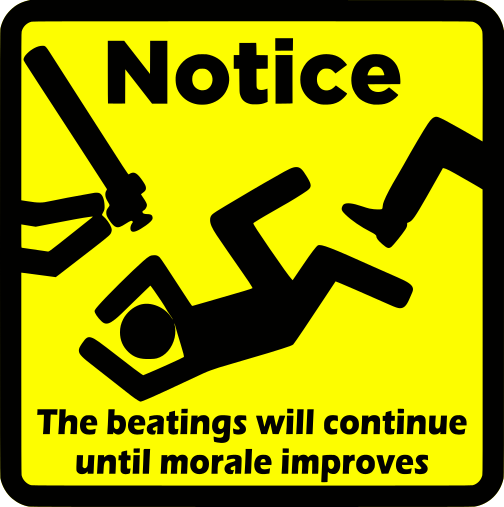

The Faculty Senate at UNL was given a copy of some [proposed metrics for the University of Nebraska System](2026-01-23-Draft-System-Metrics-ocr.pdf). 
Having just been through this nonsense at a campus level, naturally, I'm a little bit sensitive to the idea of "metrics" -- not because measuring performance is wrong (it isn't) but because it's possible to state a reasonable target goal (e.g. expected time to graduation) and then calculate it all wrong^[Say, for instance, by taking the total number of graduates as the numerator and the total number of majors as the denominator, without accounting for the fact that you've just started an undergraduate program and those majors haven't had a chance to graduate. Also, ignoring the fact that different programs have different expected completion times.], and then to use that to evaluate which programs should be cut even though different programs aren't comparable because some have part-time graduate students and some have full-time undergraduates and many MS programs are 1-2 years in length.

But, even with my general skepticism of metrics and their use for culling departments, I was not prepared for how shoddy of a job this metrics document was. 
So, let's go through this thing. 
Note that I'm working off of v1.07, so apparently this has been through at least 7 revisions thus far, and they still haven't managed to fix very basic math issues, like that 100% of 0 is ... 0.

It's somewhat difficult to critique these metrics without any idea at what level they will be calculated and how they will be used. For instance, it makes no sense to track high school recruitment visits at the department level, because most departments don't have undergraduate recruiters. 
If these numbers are tracked across colleges, it makes a bit more sense, but even then, the College of Education and Human Sciences has a lot of programs that are graduate school only, so tracking first-time full-time freshmen enrollment will put them at a massive disadvantage relative to e.g. Arts & Sciences. 
Not to mention, the relative size of a department at the start of metric tracking should be considered! Smaller colleges do not have the ability to vastly change enrollment sizes without additional resources, where it's somewhat* easier to do that in larger colleges by tweaking class sizes, teaching loads, and so on. 

# Extraordinary Teaching & Learning    
Establish the University of Nebraska System and its educational programs as the most extraordinary learner-centered university with nationally recognized programs and top tier faculty and staff.

## Strategy: Inspiring all Future Learners

Ref # | Category | Name | Weight? | Definition | Growth Target 2025-26 | Growth Target 2027-28
---- | ---- | ---- | ---- | ---- | ---- | ----
1.1.1 | Enrollment | Total Student Headcount | 1.25 | Total enrolled student headcount at Census. | 1% | 2.5%
1.1.2 | Enrollment | Total Student Credit Hours | 1.25 | Number of enrolled credit hours at Census. | 1% | 2.5%
1.1.3 | Enrollment | FTFT Student Headcount | 1 |  Headcount of first-time, full-time students (freshmen). | 1.5% | 3%
1.1.4 | Enrollment | FTFT Student Credit Hours | 1 |  Number of credit hours enrolled among first-time, full-time students (freshmen). | 1.5% | 3% 
1.1.5 | Enrollment | Transfer-in Headcount | 1 | Headcount offirst-time undergraduate transfer students. | 3% | 5%
1.1.6 | Enrollment | Internal Undergraduate-to-Grad/Professional Transition Rate | 1 |  Percentage of students who earn an undergraduate award in the prior two academic years and are enrolled in a graduate/professional program at NU the subsequent fall semester. | 2% | 10%
1.1.7 | Enrollment | High School Recruitment Visits | Number of high schools visited by NU recruiters | 100% | 100% of all NE schools
1.1.8 | Enrollment | Freshmen Student Admission to Matriculation Rate |  Percentage of admitted freshmen students who matriculate the following semester that applied during the prior academic year. | 5% | 10% 
1.1.9 | Enrollment | Transfer Student Admission to Matriculation Rate | Percentage of admitted transfer students who matriculate the following semester that applied during the prior academic year. | 5% | 10% 

Most of these metrics will be vastly different for different departments and will result in "apples to airplanes" comparisons between departments with majors-only course enrollment and departments who teach general education courses that have enrollment from majors across the university. Departments with only graduate students will also be at a vast disadvantage to those with undergraduate and graduate students. 

The problem with these metrics is not so much that they're being measured -- they are perfectly reasonable things to measure -- but with the potential ways the metrics will be used to compare between units. 

One problem we have in statistics and data science is that most people don't come out of high school knowing they want to be statisticians. Instead, people take math courses, discover that they're interested in applied math but maybe not theoretical math, look around, and decide to go for statistics or computational biology or data science. You need a certain baseline level of experience in mathematics before statistics starts to sound interesting to you. 
As a result, I'm incredibly wary of metrics that evaluate departments on things like first time freshmen recruitment and admissions because they put some departments at a disadvantage simply based on the fact that their disciplines are less familiar. 
College should be about discovering your intellectual passion(s) - this discovery process is important, and calculating metrics without taking that into account ensures that the university is much more like an assembly line, pushing high schoolers through a pre-made path until they're college graduates, without any of the internal growth that helps turn high school students into passionate adults. 
Education should not be a widget factory. /end rant

## Strategy: Transforming the Learning Environment

This one is another bugaboo for me. If you're going to transform the learning environment, you might want to talk to faculty before you set metrics up to specify what it's being transformed into. You might also want to talk to students to see what they actually want and need out of their educational experience beyond the diploma/credential. 

Ref # | Category | Name | Weight? | Definition | Growth Target 2025-26 | Growth Target 2027-28
---- | ---- | ---- | ---- | ---- | ---- | ----
1.2.1  | Student Success | Fall-to-Fall Retention | 1.25 | Percentage of all undergraduate degree-seeking students enrolled at the prior fall census who re-enroll or graduate before the subsequent fall census. | 2% | 6%
1.2.2  | Student Success | First Year Retention Rate (First Time Cohort) | 1.25 | Percentage of first-time bachelor's-seeking students enrolled at the prior fall census who re-enroll at the subsequent fall census. (HLC Indicator) | 2% | 6%  
1.2.3  | Student Success | Overall DFW Rate | 1 |  Percentage of undergraduate course attempts that results in a D, F, or student withdrawal. | -2% | -10% 
1.2.4  | Student Success | Math/Quantitative Literacy DFW Rate | Percentage of undergraduate math/quantitative course attempts that results in a D, F, or student withdrawal. | -3% | -15%
1.2.5  | Student Success |  English Comp DFW Rate |  Percentage of undergraduate English Comp course attempts that results in a D, F, or student withdrawal. | -3% | -15%
1.2.6  | Student Success | Completion and Transfer Rate at 8 Years After Entry |  Percentage of all entering undergraduate students in a particular cohort year who complete their educational program or transfer to subsequent institutions, measured at 8 years after entry. (HLC indicator) | 2% | 8% 
1.2.7  | Student Success |  Undergraduate Graduation Rate (150% of Normal Time) | Percentage of the bachelor’s or equivalent degree and other degree/certificate-seeking adjusted cohort that completes an award in six years or 150% of normal time. (AAU informational indicator) | 2% | 6% 
1.2.8  | Student Success | Pell Grant Recipient Graduation Rate (150% of Normal Time) | Percentage of the Pell bachelor’s or equivalent degree and other degree/certificate-seeking adjusted cohort that completes an award in six years or 150% of normal time. (AAU informational indicator) | 3% | 8% 
1.2.9  | Student Success | Pell Graduation Rate Gap | Gap between Pell Grant Recipient and Undergraduate Graduation Rate (150%[^129]) (AAU informational indicator) | -3% | -10%
1.2.10 | Student Success | Post Graduate Debt-to-Earnings Success Rate | Percentage of NU programs meeting the DOE’s established debt-to-earnings performance benchmarks. (DOE Indicator) | 100% of programs | 100% of programs 
1.2.11 | Student Success | Post Graduate Earnings Premium Success Rate | Percentage of NU programs meeting the DOE’s established earnings premium performance benchmark. (DOE Indicator) | 100% of programs | 100% of programs

[^129]: The (150%) is included in the original document, and I assume that in this case it's the 6-year graduation rate. Otherwise it looks like a bad copy-paste error, but there are no obvious candidates in the immediate vicinity.

Ok, so this batch of metrics has some serious issues, most of which are that the metrics themselves are reasonable to look at, but without additional resources directed towards addressing e.g. DFW rates, the end result will be to push the NU system towards being a diploma mill. 
Faculty want to have actual standards for what students leave class knowing, but most of us are juggling so many competing demands that if the right shitstorm appears, it's easier just to say "Not today, Satan" and comply with the policies that administration dictates, like letting students cheat like fiends, learn nothing, skip class, etc.
Again, that's not what we'd prefer to do, for the most part -- we generally love learning, and want our students to learn and enjoy the process as well -- but if you make doing anything else a complete pain in the ass, force us to attend endless academic integrity hearings, and otherwise impose a bureaucratic hellscape, well, we respond to incentives^[Not always in predictable ways, though -- sometimes we choose malicious compliance, sometimes we slow-walk, and sometimes we are incredibly spiteful. That said, most of us care more about our research and our good students than we do about making sure to fail the problem children.].  

::: aside
{fig-alt="A picture of a laying-down stick figure being kicked and beaten with a caption of 'the beatings will continue until morale improves'. The picture is in black with a yellow background to resemble a caution/safety sign."}
:::

