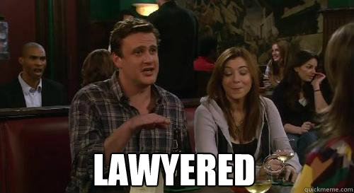

In the last few days, I've finished my final lecture at UNL, completed a pile of grading, submitted a subaward in a new collaboration (with people I met as a result of the elimination of my department). But, the thing that took more time than most of those things put together was advocating for students in the four departments which have been eliminated.

This was primarily done by emails; I will provide them here in a redacted form to protect both the identities of my student and the administrators, though I am sure Dr. Google will help you with the administrator identities. 

::: {.callout-note collapse=false}

## Subject: Supervising Students in Eliminated Departments

Dean Wormer^[[Not his real name.](https://en.wikipedia.org/wiki/Animal_House)],

A question came up in our department meeting - how does UNL intend to compensate faculty who have left the institution but are still advising/supervising students who are still at UNL?

I have a student whose dissertation is not something that the remaining faculty can supervise or serve as domain experts (the student is investigating [computer sciency things and perception and statistics]). Someone can handle the role of the major professor on paper (institutional responsibilities, signing forms, etc.), but no one remaining in the department has the domain expertise to serve as a content expert or advise the student on the actual writing, publishing, etc. that comes along with serving as the major professor. 

I am sure UNL is not expecting faculty who were terminated to do unpaid labor for UNL after they leave, so what is the plan for compensating us for that labor? 

Susan Vanderplas    
Associate Professor    
Statistics Department    
University of Nebraska -- Lincoln    

:::

::: {.callout-warning collapse=false}
## Re: Supervising Students in Eliminated Departments

Susan,

Thank you for raising this question. We take very seriously our responsibility to support students through degree completion, particularly in situations involving specialized academic work. We appreciate you flagging this as part of forward-looking continuity planning.

As a general matter, the University does not anticipate providing additional compensation to faculty who have separated from the institution for any continued advising or engagement with students, nor does it require such continued involvement. Any post-separation engagement would be voluntary and outside the scope of a formal University appointment. In many cases, when a faculty member transitions to a new institution, any ongoing scholarly engagement of this nature may be considered as part of that faculty member’s broader academic service and professional contributions, and may be addressed, as appropriate, in connection with their new institution’s expectations regarding research, teaching, and service.

With respect to institutional responsibilities at UNL, as you know, each student must have a designated major professor of record who is responsible for fulfilling University requirements, including oversight, approvals, and progression through the degree process. We recognize that, in certain instances, this individual may not have the same subject-matter expertise as the prior advisor. In those cases, the University may need to consider alternative structures to support the student’s academic progress, which could include committee-based advising models or other appropriate arrangements.

We are not aware of any general practice of providing stipends or other compensation to former faculty for continued advising following separation, with the exception of one highly unique and fact-specific situation involving multiple students and specialized circumstances. That instance should not be understood as establishing a broader precedent.

We appreciate your focus on ensuring continuity for students and are happy to continue working with departments to identify appropriate paths forward in individual cases.

Regards,

Dean Wormer

:::

Wow, ok. So from this it is clear that the University doesn't anticipate... basically anything. 
They haven't considered that the faculty they fired while evading the protections of tenure might feel like this is not a standard transfer to a new institution. 
They haven't thought about the fact that they eliminated a large proportion of the faculty in a specific discipline, and thus they may not be *able* to find new advisers for the students who remain longer than the faculty. 

After a discussion at the Faculty Senate Executive Committee meeting, I was even more angry than I had been to start with. 
The idea that UNL would fire me (after getting tenure) and then expect my new employer to pay me to fix their problems. 
The idea that my expertise was clearly not at all appreciated, and UNL admin really didn't seem to understand that they were losing something. 
The fact that there is *so much* labor that faculty do on a daily basis that is not seen, appreciated, or compensated by the institution -- but that same labor is what makes the institution function and what makes getting an education worthwhile^[Things like building relationships with graduate students, mentoring them so they'll be successful long-term, and setting them up with research projects that are interesting *to them* as well as productive for my long-term goals (ideally). Things like working with undergrads who are having trouble, sitting down with them to help talk through issues, or even just being there when they're stressed and overwhelmed and offering a listening ear, a tissue box, and/or a hug.]. 

Someone on the Senate Exec committee suggested that maybe the administrator didn't know I wasn't going to be at UNL next year and suggested I reply to the email adding that information, just in case. 
I set out to do just that when I got home from the meeting.

Sometimes, when I get really, really mad about something that's intellectual, I go into what I think of as "lawyer mode". 

::: aside
{fig-alt="A scene from How I Met Your Mother where Marshall is pointing, with the text 'Lawyered' in white at the bottom."}
:::

I did that when I first learned about how firearm and toolmark examiners testify in court and the things they get away with, like being considered an expert in experimental design because they took a biostatistics course in college^[[No, I'm not joking.](20201015-Transcript-Harris-001.pdf)].
And I ended up in lawyer mode again trying to provide the information that I was leaving in a way that might motivate this particular administrator to action. 

It got a little bit out of hand, seeing as how the first paragraph was the email I set out to write...

::: aside
Specific details included in the original email have been modified or redacted to protect the student's identity and the identity of specific faculty members. 

I've also made use of markdown formatting to allow you to collapse the distinct chunks of this email because it does get a bit overwhelming... The headers and such do not appear in the original because web-based Outlook email doesn't have even the minimal features in pandoc/quarto markdown. 
:::

::: {.callout-note}
## Re: Re: Supervising Students in Eliminated Departments

Dean Wormer,

I want to address a few of the points in your email, but first, you need to know that I will not be at UNL after July 31, 2026. 
I have accepted a position at Utah State and will be moving over the summer. 
I am convinced that this is a broader issue, but the situation with my student will need to be resolved before the end of the contract period.

While I am lucky to be able to make this move before the May 2027 termination date, I would not consider leaving UNL to be voluntary - indeed, I had no plans to move from UNL before the end of October 2025 (and even then, I was exploring contingency plans). 
I explored many different ways to stay at UNL and was still trying to make those work through the end of March, even as I interviewed at other universities. 
From my perspective, I have done as much as possible to avoid having this conversation. 

::: {.callout collapse=false}
### Graduate Advising was Unusually Disrupted by Program Closure

> We are not aware of any general practice of providing stipends or other compensation to former faculty for continued advising following separation, with the exception of one highly unique and fact-specific situation involving multiple students and specialized circumstances. That instance should not be understood as establishing a broader precedent.

I do not know about the "unique situation" you refer to, but this situation is categorically different from a voluntary faculty move between institutions, where the expectation is that the faculty member will finish out students from their new institution or hand students off to colleagues who remain at the institution. 
In a voluntary situation, faculty have time to wind down supervisory duties in preparation for a future move, and can work with all of the colleagues in their department to find appropriate solutions for each student.

Faculty in eliminated departments had, at best, 18 months to wind down their commitments, when a Ph.D. in statistics takes 4-5 years (starting from a BS) to complete. 
No eliminated faculty who remain for the 26-27 AY have any incentive to take on additional students — there is no benefit to taking on that extra work, and a year is not sufficient to reorient a dissertation to the new advisor's research area. 
The two remaining faculty members have expertise in stat education and statistical genetics — useful areas, to be sure, but they are not going to be able to effectively supervise and mentor projects in Bayesian statistics, computational statistics, graphics and data visualization, data science, and many other areas.

The normal process when faculty leave for another institution does not apply to this situation^[Perhaps the closest situation is when a faculty member is denied tenure and leaves the institution, but even in that situation, there is usually a year to wind things down and transfer students, and a whole department of potential advisors to choose from.]. 
**When a program is closed, HLC requires that students are given the opportunity to finish their degrees. For doctoral students, this is not just an obligation to offer classes required for students to graduate, but an obligation to ensure that there are appropriate supervisory resources available.**

:::

::: {.callout collapse=false}
### Faculty Should be Compensated for Advising Labor

UNL providing compensation for the additional advising due to program closure is not unprecedented — in fact, there is precedent from this round of budget cuts! 
EDAD faculty, who are on 9-month contracts, are being given summer funding to get as many students as possible through quickly. 
Clearly, in CEHS there is at least some recognition that

1. faculty advising is work that should be compensated,  
2. program elimination creates additional work due to the need to get students through quickly, minimizing the costs of an extended teach-out period, and 
3. this extra work is outside of the existing contract.

It is not a stretch to think that the additional labor of continued advising would be compensated, should faculty take on that burden after leaving UNL in order to ensure that their students succeed.
After all, that's why we're all in this business. While we care about our students, that does not change the fact that advising and mentoring students is work. 
Advising and mentoring students who will graduate from UNL is work **for UNL** that contributes to UNL's reputation and fulfills the research and teaching missions of the university. 
In addition, this is the simplest and easiest option for UNL, as it does not delay student graduation, maintains existing relationships, and does not require additional administrative work to assemble and coordinate substitute committee-based advising panels.

Even federal agencies now pay a minimal stipend for grant review (which is service to the discipline) in recognition that reading and evaluating a proposal is work^[NSF and NIJ both offer stipends for proposal evaluation on the order of $175-200 per proposal. 
I have no experience with other agencies, but NIJ is not usually on the bleeding edge when it comes to procedural changes.]. 
Supervising a dissertation involves reading and revising on a scale far beyond a grant proposal, with a corresponding time commitment.^[When I went through P&T evaluation, I had to provide a mentoring plan to my department P&T chair, to ensure that I was providing my graduate students with an appropriate amount of attention - at least one hour of one-on-one meeting a week, plus the time outside of the meeting to review, correct, critique, and comment on research products — during a student's last year, this writing/editing cycle can take several hours per week.] 
That is not an insignificant amount of labor, and the vast majority of that labor must be done by someone with expertise specific to the student's dissertation area. 
While there are rare students who can entirely direct their own dissertation projects, the design of doctoral programs in the US **includes individual mentoring from someone with subject-matter expertise as a critical and significant component of the program**.  

:::

You mention two options for this that do not require additional explicit budget commitments: committee-based advising, and advising as part of service to the discipline. I'll address each of these in turn.

::: {.callout collapse=false}

### Committee-based advising

> "each student must have a designated major professor of record who is responsible for fulfilling University requirements, including oversight, approvals, and progression through the degree process. We recognize that, in certain instances, this individual may not have the same subject-matter expertise as the prior advisor. In those cases, the University may need to consider alternative structures to support the student’s academic progress, which could include committee-based advising models or other appropriate arrangements."

Committee-based advising models may be sufficient for some students, but it will not be sufficient for all of them. 
"Other appropriate arrangements" could include compensating former UNL faculty members for their labor in order to ensure a smooth teach-out period, but I digress.

Of greater concern is that **faculty are not interchangeable widgets**, and **faculty expertise is an essential component of the mentoring and advising that goes into a PhD.** 
This is why PhD programs require a sizeable number of dissertation research hours. 
Of course, having someone in the system as supervising those hours is the easy part — the hard part is ensuring that the student gets the proper mentoring during the teach-out process. 

**Faculty at R1 institutions are expected to do unique, cutting-edge research**; this does not lend itself to easy substitution of one faculty advisor for another.
Of the faculty in statistics, I could reasonably advise one other person's students, and even then, there is maybe a 75% overlap in research expertise. 
At my new institution, there is even less overlap - maybe 40% overlap with one other statistics faculty member. 
There is obviously some selection bias here — departments naturally want to balance the potential for collaboration with the risk of duplication. 
Hiring someone with the same expertise as another member of the department does not add as much value as hiring someone with expertise in an entirely different area.

I think in this case, it is helpful to consider the student I mentioned during my original inquiry. They plan to graduate within the next year, and have done much of the work on her dissertation project, which they have been working on for 3 years at this point. Most of what is left is writing, though there may be a few small simulations to run.

I see three different committee-based options for this student, from UNL's perspective:

1. Find someone who is willing to rubber stamp the student's work as meeting the standards for a PhD at UNL.    
This would be a disservice to the student and would seriously impact their ability to compete for academic or industry positions. However, this approach would probably still allow the student to graduate as planned, and there are faculty who would be willing to go along with it. While this does not actually fulfill the commitment UNL made to students in eliminated programs, it would be hard to get HLC to do anything about it. 

2. Find new advisor(s) (single or committee) and have the student start the dissertation research process again.    
This is a better option for the student — it allows them to finish the degree with some integrity, and provides the student with access to the faculty expertise that is an integral part of the PhD training process. The student would be more competitive on the job market, having worked closely with a single advisor to finish the second dissertation project, though they might not be interested in the topics available (which extends completion timelines, in my experience). It would slow the student's progress to graduation, requiring additional funding beyond what the department has committed. I would estimate that the student's anticipated graduation date might 6-12 months later than currently planned.

3. Assemble a committee of faculty in roughly adjacent areas and have them to supervise the project. I've done the legwork on this for you by surveying the obvious departments related to my research area(s):
    - In Statistics, your closest option is \<redacted\>, but I am not sure of her plans for the next academic year. Our research areas overlap somewhat, however, this project developed out of a research project that was a significant deviation from my previous work.  \<redacted\> has not done much work with computer vision models, and I have always been much more psychology-oriented, so this is only a partial solution. 
    - Since your email on Saturday, I have taken the time to verify with colleagues in Computer Science that they do not have the faculty expertise in computer vision models necessary to support the project. \<redacted\> is the closest, but their research is in synthetic biology, which is not close to computer vision even within computer science and artificial intelligence. 
    - The closest faculty member in Psychology is probably <redacted>, who uses \<redacted method\> to study attention and perception. They do not, to my knowledge, dabble in computer vision, neural network models (at least, as they are conceived in computer science and statistics), or computational modeling outside of <redacted method>. I am sure he is familiar with at least some of the psychology literature relevant to this problem. 

On a personal level, I would happily entrust my student to a committee made up of \<redacted 3 people\> - they're all wonderful researchers and delightful people. However, I do not believe that the "dream team" I've assembled would be able to get the student to graduate as planned — it would take a lot of time and work for any of them to get up to speed on this project, and none of them has even two of the three components necessary for this project (computer vision/neural network models, the neuroscience underlying Gestalt perception, and the application area in statistical forensic pattern matching). This project began as an investigation of a niche I found interesting, and it has proved to be a difficult problem to solve; I've invested 8 years in building the expertise necessary to supervise a student in this area.

Even assuming that these committee members can get up to speed quickly, it will take more time for the student to graduate. I'm not accounting for the known problems with committee design work^[The adage of a camel being a horse designed by committee comes to mind.], but that will certainly be a factor. 
In addition, though, there are other concerns: even within UNL, service on outside doctoral committees is considered a very minor contribution. 
In this case, it is a minor contribution with a major time investment to complete the work properly. 
Even ignoring the EAS, TMFD, and EDAD students, **IANR would need to convince faculty in other colleges to invest a significant amount of time for relatively little payoff, at a time when faculty labor is in short supply due to VSIP**. 

What is more problematic, from an institutional perspective, is that (as far as I can tell) **UNL has not taken any census of existing graduate students in eliminated programs to determine whether the relevant expertise is available to supervise dissertations using this model**. 
There has also not been a survey of terminated faculty to determine when they plan to leave the institution and whether they might be available beyond May 2027^[This is the termination date provided for faculty in eliminated departments.]. 
This planning is an administrative responsibility - it should have been part of the budget reduction proposal to consider these factors and ensure that students were supported, but this did not happen. 
It is absolutely not the responsibility of eliminated (or retained) faculty to take on this planning burden in addition to standard teaching, research, and service responsibilities. 
It is thoroughly unreasonable to expect that the remaining two faculty members can adequately design committees for the statistics graduate students. 
**Given that UNL is moving to a distributed model for statistical expertise, this coordination will need to happen across colleges, through a top-down process originating in the graduate college or IANR.** 
A distributed model does not diffuse the responsibility for coordination and communication. 

:::

::: {.callout collapse=false}

### Advising as service.

> "In many cases, when a faculty member transitions to a new institution, any ongoing scholarly engagement of this nature may be considered as part of that faculty member’s broader academic service and professional contributions..."

There are multiple issues with this conceptualization. 
I cannot resist pointing out the irony of IANR relying on notions of broader academic service while refusing to include even a nominal percentage of service in faculty position descriptions, counter to norms in other colleges at UNL as well as across academia.

- Faculty will not necessarily be leaving for positions at academic institutions.    
Some will not be geographically mobile, and UNL is essentially the only game in town; it is likely that some terminated faculty will take industry positions. Industry positions do not come with the expectation of service as part of the position description. Thus, **depending on ongoing collaborations does not ensure that students are adequately supported in degree completion.**

    - Considering "ongoing scholarly engagement of this nature" as part of that faculty member’s "broader academic service and professional contributions" is interesting in the context of industry. Private companies do not generally donate employee labor to other companies, or even to not-for-profit organizations. It is even more nonsensical to expect this of another academic institution — essentially, UNL is relying on donations of free labor from competitors in the academic marketplace. 

- In any new academic position, there is a conversation to determine how service should be allocated to balance the needs of the institution, department, and discipline with the interests and commitments of the new faculty member.  
Lack of foresight and planning on UNL's part to identify and prepare for the inevitable consequences of the budget reduction does not create an obligation on the new employer to carve out room for that labor as service. 
While faculty might be concerned with the fate of students left behind at UNL, this does not make the advising labor "broader academic service" that falls within the scope of duties at another institution. 

- The 5-10% service that is typical in academic positions is usually an under-estimate. Most faculty do far more service work than the 2-4 hours per 40 hour work week corresponding to 5-10%^[Of course, the 40-hour work week is also an underestimate, so it is possible that proportionately service remains at 5-10%. On weeks that I have been diligent about time-tracking, I spend close to 8 hours/week on service - faculty meeting, 3h exec meetings, 2h of editorial work, and 2h of assorted emails, conference organizing, and professional organization work. I am not counting the legal consulting work I do that could also be counted as service.]. 
However, that does not mean that this work is not economically valuable. 
In fact, **the inclusion of service as an explicit part of faculty responsibilities is a value statement that service work is still compensable labor.**

- Service apportionments typically cover **institutional service** and **service to the discipline**. 
Service either benefits the institution directly (committee work, shared governance, etc.), or the visibility of the faculty member within the discipline (professional organization service, editorial work, peer reviewing).

    - **Institutional service refers to service at the faculty member's current institution**, so advising students at other institutions would not be considered institutional service for evaluation purposes^[I directly inquired about how advising students at a previous institution would be evaluated at UNL when I started working here; it was absolutely not considered service].   
    - Advising UNL students does not raise the profile of the faculty member within the discipline in the same way as editorial work or professional organization work, as any relationships with faculty at UNL would already be established; continued advising provides no marginal benefit to the faculty's profile within the discipline.
 
- **UNL has not historically counted outside advising as service.**    
It is interesting that it's service when former UNL faculty to supervise students after they've taken a job at another institution, but it was not service (or even considered a productive use of time) for UNL faculty to supervise students at a different institution.
Conversations with faculty at other institutions suggest that this view of advising outside your institution is normative, though not universal. 

    - When I left Iowa State for UNL in 2020, I was advised by my chair at UNL that ISU students would not count as students I had supervised. It was suggested that continuing to advise these students was not a productive use of my time and would negatively affect my ability to get tenure here, because time spent on that would be better applied to UNL-specific work. I did the responsible thing and continued to meet with the student until they finished the project I had been advising. This time was not considered service (to the institution or the discipline) or teaching, and at best, I got some minimal credit for research products (coauthored publications) on annual performance evaluations. 
    - In 2022, I was asked to serve as a minor (10%) advisor of a graduate student at a university in Australia — a student who was being advised by a collaborator. The PhD committee at Australian universities serves a similar role to the research advisor in the US, with each member assigned a percentage of the advising responsibility; the dissertation is evaluated by external reviewers, and there is no formal defense presentation. I was told that UNL would not consider serving in this capacity to be an appropriate use of my time — not that it wasn't research or teaching, but that it was not ok to supervise students at another university, because it competed with supervising UNL students. It was absolutely not considered service, but that might well be due to IANR not using service as a category.

:::

If ongoing advising is not service, and committee based advising models do not work well for most statistics dissertations, then the logical "other arrangement" is to follow EDAD and compensate terminated faculty after they leave UNL for the work they do to continue to advise their students. 
I'm not suggesting that UNL pay us a rate equivalent to what I charge for consulting (250-400/hour), but I do think it is important to acknowledge that this labor has value. 
I also think it's a good idea for UNL to avoid the appearance of asking terminated faculty members to work for free after they have left UNL.
Most importantly, though, I want to make sure that graduate students in terminated departments do not fall through the cracks, and the model you've proposed makes it clear that there has not been any administrative planning to prevent that outcome.

I'm sorry - I really did not set out to write a novel, but there are a host of problematic assumptions underlying the thought process presented in your email that raise real concerns^[To put it a different way, I went in to mama-bear mode because it's clear that no one here is looking out for the interests of my students.]. 

Susan

:::

